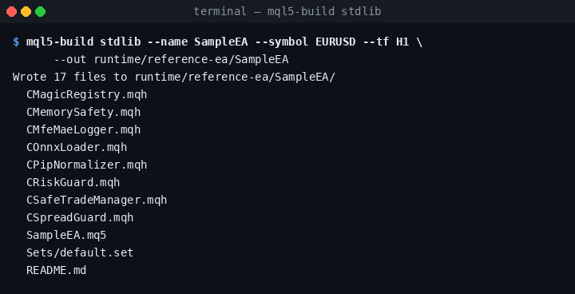
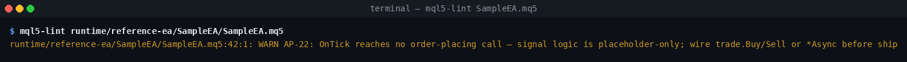
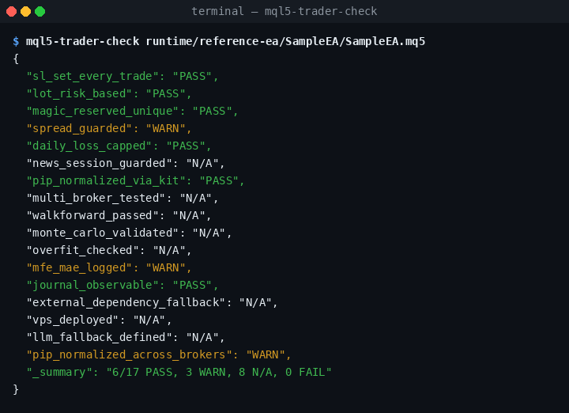
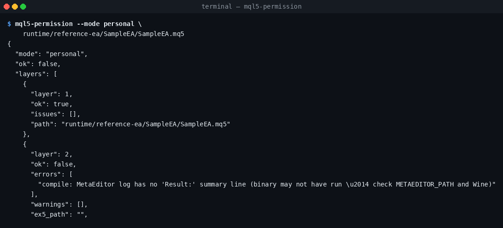

# Quickstart — 15 minutes

> **Honest disclaimer.** `Trader-17`, the `8×8 quality matrix`, the
> `AP-1…AP-25` anti-pattern IDs, the 7-layer permission pipeline, and the
> RRI personas are **project-defined heuristics** designed by this kit.
> They are opinionated guardrails — not industry standards, not
> certifications, and not substitutes for live-account validation.

15 minutes from a fresh clone to your first lint-clean scaffold, with
the kit's gates telling you exactly what is and is not ready to ship.
No prior MQL5 experience required. Wine and MetaEditor are **optional**
for steps 1–4; they only matter when you want a real `.ex5` compile in
step 5.

The full Vietnamese master guide lives at
[`docs/HUONG-DAN-TOAN-TAP-vi.md`](HUONG-DAN-TOAN-TAP-vi.md).

---

## 1. Install (≈ 3 min)

```bash
# Unzip the downloaded release (.zip) to get started
cd vibecodekit-mql5-ea
python -m venv .venv && source .venv/bin/activate
pip install -e ".[dev]"
```

Confirm the kit imports cleanly. `--soft` reports environment probes as
warnings instead of failures so you can keep going without Wine:

```bash
python -m vibecodekit_mql5.doctor --soft
```

---

## 2. Scaffold your first EA (≈ 1 min)

```bash
mql5-build stdlib \
    --name SampleEA \
    --symbol EURUSD --tf H1 \
    --out runtime/reference-ea/SampleEA
```

`stdlib` is the safest starting preset — netting account, single
symbol, single entry per bar. Run `mql5-build --list` (or look at
`scaffolds/`) for the full preset/stack matrix.



The generated `SampleEA.mq5` already includes `CPipNormalizer`,
`CRiskGuard`, `CMagicRegistry`, `CSpreadGuard`, and `CSafeTradeManager`
— the cross-broker pip math + risk caps + magic-number registry the
kit's gates expect.

---

## 3. Lint (≈ 30 s)

```bash
mql5-lint runtime/reference-ea/SampleEA/SampleEA.mq5
```



A fresh scaffold reports `0 ERROR, 1 WARN` — the WARN is `AP-22`
("signal logic is placeholder-only"). That's the kit reminding you the
scaffold has no order-placing call yet: it's a skeleton, not a
strategy. The 25 anti-pattern detectors are documented in
[`AGENTS.md` § Rule ID → documentation table](../AGENTS.md#rule-id--documentation-table)
and in `docs/anti-patterns-AVOID.md`.

---

## 4. Trader-17 readiness check (≈ 30 s)

```bash
mql5-trader-check runtime/reference-ea/SampleEA/SampleEA.mq5
```



The Trader-17 checklist is a 17-point pre-deployment heuristic this
kit defines (see the built-in 59-point Trader checklist).
The gate requires **≥ 15 / 17 PASS**; a fresh scaffold reports 6 PASS,
3 WARN, 8 N/A — many checks (walk-forward, Monte-Carlo, multi-broker,
overfit, VPS, news-session) require **external evidence** before they
can score. The bare scaffold legitimately cannot pass yet, and that's
the gate **working as intended**.

---

## 5. Permission pipeline (≈ 1 min)

The 7-layer permission pipeline is a project-defined gate that runs
source-lint → compile → AP-lint → Trader-17 → methodology →
quality-matrix → broker-safety. It is **fail-fast** — the first failing
layer stops the rest from running.

```bash
mql5-permission --mode personal \
    runtime/reference-ea/SampleEA/SampleEA.mq5
```



On a Linux box without Wine, layer 2 (compile) fails-fast because
there is no MetaEditor binary to invoke. That is correct: the gate
will not silently skip compile. To clear layer 2, install Wine +
MetaEditor:

```bash
./scripts/setup-wine-metaeditor.sh # ~3 min, Linux only
```

Once layer 2 is green, layer 4 (Trader-17) is the next to gate-fail on
a bare scaffold — until you wire a real signal, the Trader-17 checks
still score below the 15/17 threshold. Iterate by editing the signal
block in `SampleEA.mq5`, then re-run the pipeline.

---

## 6. Iterate (the productive minutes)

The build → lint → trader-check → permission loop is what you cycle
on while writing your strategy. A one-shot version of the whole
pipeline lives at:

```bash
mql5-auto-build --spec EA-IR.json --out-dir build/MyEA
```

…which chains scan → build → lint → compile → permission → dashboard
and writes a single idempotent `auto-build-report.json`.

Generate canonical EA-IR from a free-text idea, then feed it directly to the
auto-build pipeline:

```bash
mql5-spec-from-prompt \
    "EA named TrendEA, account netting, EURUSD H1, trend-following, risk 0.5%" \
    --strict --out EA-IR.json
mql5-auto-build --spec EA-IR.json --out-dir build/MyEA
```

The older single-preset YAML is compatibility-only and must be requested with
`--legacy`; it carries `compatibility.release_eligible: false`.

---

## 7. Release gate (≈ 30 s)

When you think the EA is ready, run the full release gate for one honest
verdict across every stage (scan → contract → compile → backtest →
quality → stress → evidence):

```bash
vkmql-check all path/to/your/project          # audit: exit 0 unless a stage FAILs
vkmql-check all path/to/your/project --require-release   # CI: only passes when release-eligible
```

> **`build` does not auto-run this gate, and does not emit the governance
> contract artifacts.** `mql5-build` / `mql5-auto-build` scaffold and
> compile the EA, but the gate's `contract` stage needs `EA-SPEC.yaml` +
> `AI-BUILD-CONTRACT.md/.json`. Generate them once with:
>
> ```bash
> vkmql-new spec path/to/your/project --name MyEA --symbol EURUSD --tf H1
> vkmql-new contract path/to/your/project --name MyEA
> ```
>
> Then re-run `vkmql-check all`. Without these files the `contract` stage
> FAILs by design (the gate prints the exact commands to fix it). A
> freshly scaffolded project is still never release-eligible until real
> compile + backtest evidence exists — UNTESTABLE stages block release.

---

## Where to next

- [`README.md`](../README.md) — feature inventory + capabilities map.
- [`AGENTS.md`](../AGENTS.md) — canonical contract for AI coding agents
  (rule_id → doc table, JSON envelope schema, reference numbers).
- [`docs/COMMANDS.md`](COMMANDS.md) — every CLI command grouped by
  lifecycle stage.
- [`docs/USER-GUIDE-en.md`](USER-GUIDE-en.md) — step-by-step
  walkthroughs.
- `docs/reference-ea/REPORT.md` — honest
  empirical numbers from the gates on a freshly scaffolded EA.
- [`docs/anti-patterns-AVOID.md`](anti-patterns-AVOID.md) — the
  architectural anti-patterns this kit refuses to ship.
- [`docs/HUONG-DAN-TOAN-TAP-vi.md` (§4 chat-driven build)](HUONG-DAN-TOAN-TAP-vi.md) —
  chat → spec → auto-build → PR playbook for Devin.

The numbers shown in this guide are reproducible — regenerate them
yourself any time with:

```bash
bash scripts/tools/build_reference_report.sh
python scripts/tools/render_quickstart_screenshots.py
```
